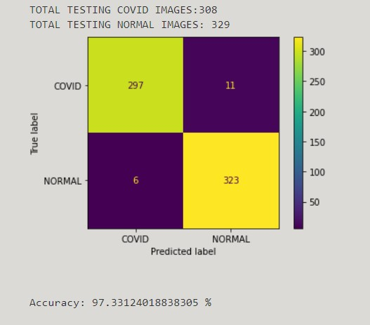

# Covid-Pneumonia-Detection-CNN-
This is a convolutoin neural network (CNN) model that detects possible pneumonia in covid patients using Ground Glass Opacities from Chest X-ray images. 

You can run the Project by following steps:
```
1. Install python packages in requirements..txt 
   --> pip3 install -r /path/to/requirements.txt
```
```
2. In app.py, we have loaded model, named [Best Model] using keras.
  The drive link to the folder is :
  https://drive.google.com/drive/folders/1UrPKN6biNxmToJjR6xIsdX0hCnUZgulq?usp=sharing
```
```
3. python3 app.py
```
Below is the Classification Matrix [Metric for Accuracy] :

